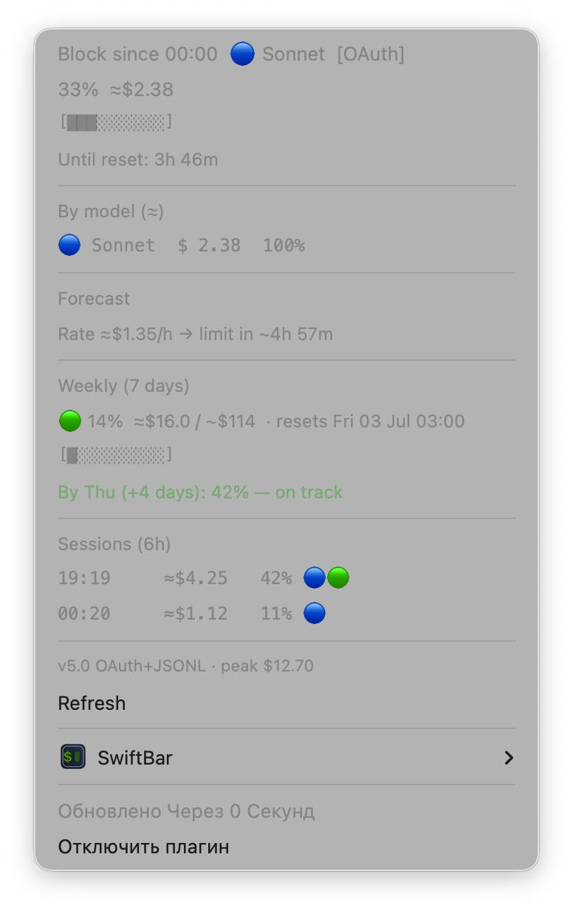

# Claude Pro Usage Monitor for SwiftBar

A lightweight macOS menu bar plugin that shows your **Claude Pro 5-hour session limit** and **weekly usage** — directly from Anthropic's servers.



## Features

- **Exact accuracy** — reads `utilization %` straight from Anthropic's OAuth endpoint (same data as claude.ai dashboard)
- **Instant response** — no Node.js, no `ccusage`, pure Python + stdlib (~1s total, parallel HTTP + file I/O)
- **5-hour block tracking** — current %, time until reset, exact countdown from Anthropic's `resets_at`
- **Weekly limit** — 7-day utilization + projected % by end of week (Fri–Thu cycle)
- **Model breakdown** — Opus / Sonnet / Haiku cost split from local JSONL logs
- **Burn rate forecast** — "at this pace, limit in ~2h 30m"
- **Session history** — previous blocks in the last 6 hours
- **Graceful fallback** — if OAuth is unreachable, falls back to local JSONL calculation

## Requirements

| Requirement | Notes |
|---|---|
| macOS 12+ | Keychain access via `security` CLI |
| [SwiftBar](https://swiftbar.app) | Free menu bar plugin host |
| Python 3 | Pre-installed on macOS |
| Claude Code CLI | Provides the OAuth token stored in Keychain |
| Claude Pro account | The limit being monitored |

> **No Homebrew, no Node.js, no npm packages required.**

## How It Works

```
macOS Keychain  ──▶  OAuth token (sk-ant-oat01-...)
                                │
                                ▼
          api.anthropic.com/api/oauth/usage   ◀── same API claude.ai uses
                                │
          ┌─────────────────────┤
          │                     │
          ▼                     ▼
   five_hour.utilization   seven_day.utilization
   five_hour.resets_at     seven_day.resets_at
          │
          │  (parallel, same ~1s window)
          ▼
   ~/.claude/projects/*/*.jsonl   ──▶  model breakdown + burn rate
```

The OAuth token is already on your machine — Claude Code stores it in macOS Keychain under `"Claude Code-credentials"`. The plugin reads it with zero interaction from you.

## Installation

**1. Install SwiftBar** (if you haven't already):
```bash
brew install --cask swiftbar
```
Or download from [swiftbar.app](https://swiftbar.app).

**2. Set your SwiftBar plugins directory** — open SwiftBar, pick any folder (e.g. `~/.swiftbar-plugins/`).

**3. Copy the plugin:**
```bash
cp claude-usage.1m.sh ~/.swiftbar-plugins/
chmod +x ~/.swiftbar-plugins/claude-usage.1m.sh
```

**4. Make sure Claude Code is logged in:**
```bash
claude --version   # should print a version number
```
If not installed: `npm install -g @anthropic-ai/claude-code`

**5. Click "Refresh all" in SwiftBar** (or wait up to 1 minute for auto-refresh).

That's it. The plugin will show your current session usage in the menu bar.

## Plugin Output Example

```
🟢 15% · 4h 45m
────────────────────────────────
Block since 23:59  🔵 Sonnet  [OAuth]
  15%  ≈$1.16
  [██░░░░░░░░]
  Until reset: 4h 45m

By model (≈)
  🔵 Sonnet   $1.16  100%

Forecast
  Rate ≈$1.16/h → limit in ~7h 18m

Weekly (7 days)
  🟢 13%  ≈$14.8 / ~$114  · resets Fri 03 Jul 02:59
  [█░░░░░░░░░]
  By Thu (+4 days): 39% — enough

Sessions (6h)
  19:05     ≈$3.81   38% 🔵🟢
  ▶ now     ≈$1.16   15% 🔵
────────────────────────────────
v5.0 OAuth+JSONL · peak $12.70
```

## Configuration

Everything is automatic. Optional tweaks inside `claude-usage.1m.sh`:

```bash
SESSION_COST_LIMIT = 10.0   # assumed $ limit per 5h block (Opus baseline)
WEEKLY_COST_FLOOR  = 20.0   # minimum assumed weekly limit
WEEK_RESET_DOW     = 4      # 4 = Friday (Python weekday: Mon=0, Sun=6)
```

The refresh interval is in the filename: `claude-usage.1m.sh` = every 1 minute. Rename to `2m`, `5m` etc. to reduce API calls.

## Optional: Weekly History Collector

The `extras/collect.py` script accumulates hourly snapshots of your weekly usage via `ccusage daily`. It's only needed if you want to see detailed `$ spent this week` breakdowns (the main plugin covers weekly % without it via OAuth).

See [`extras/README.md`](extras/README.md) for setup.

## Privacy

- The plugin never sends your conversation content anywhere.
- It reads token-count metadata from local JSONL files (`~/.claude/projects/`) — no message text.
- The only outbound request is `GET api.anthropic.com/api/oauth/usage` — your own account, your own token.
- OAuth token stays in macOS Keychain. The plugin reads it per-run and holds it in memory only.

## Troubleshooting

**"No active session" when I'm actively using Claude**  
The block's `resets_at` from Anthropic is in the past → the 5h window expired. Start a new message in Claude Code to open a new block.

**Menu bar shows "🤖 –" after install**  
Check that `claude` CLI is installed and logged in: `security find-generic-password -s "Claude Code-credentials" -w` should print a JSON string.

**Percentage looks wrong / outdated**  
The OAuth endpoint reflects usage within a few seconds. Try "Refresh" in SwiftBar. If the issue persists, check your network / VPN.

**SwiftBar doesn't show the plugin**  
Ensure the file is executable: `chmod +x claude-usage.1m.sh`

## Compatibility

Tested on:
- macOS 14 Sonoma, macOS 15 Sequoia
- SwiftBar 2.x
- Claude Code CLI 2.x
- Claude Pro / Claude Max accounts

## Disclaimer

This plugin uses an **unofficial, undocumented Anthropic OAuth endpoint** (`/api/oauth/usage`). It works because Claude Code uses the same endpoint internally. Anthropic may change or remove it without notice. Use at your own risk.

---

## 💙 Support

If this tool saves you time, consider a small donation — it keeps the project alive:

| Network | Address |
|---------|---------|
| **USDT / BNB / ETH** (BNB Smart Chain, Ethereum, Polygon) | `0x8DDA7A6bdFa7Ee9D283AACb4F68Ffc86048611AF` |

The address above works for any EVM-compatible token across multiple chains.

---

## License

MIT — free to use, modify, and distribute. Attribution appreciated.
